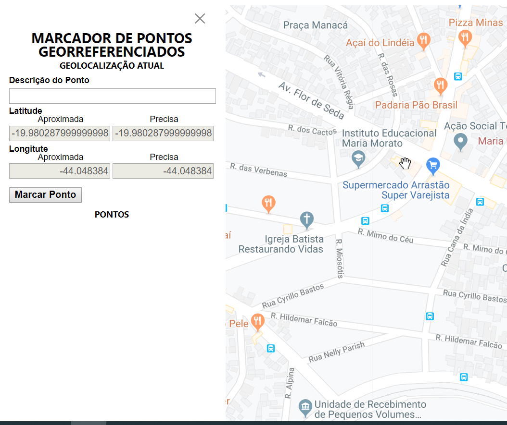

# Projeto Front-end: Marcador de Pontos Georreferenciados

O objetivo do projeto é fazer um marcador de pontos georreferenciados. Basicamente o programa utiliza a API Javascript de geolocalização encontrando a localização atual. O usuário inclui a descrição do ponto e seleciona o botão "Marcar Ponto" para incluí-lo na lista e no mapa.

## Etapa 1 (Exercício prático 01 - HTML5 APIs):

**O que foi feito:** Estruturei o HTML5 de forma semântica e utilizei o CSS reset.css para limpar os estilos. 

Utilizei a API de geolocalização do HTML5 e integrei com um mapa do Google Maps através da MAPs Javascript API, apenas para exibição dos dados em um mapa. 

**O que ainda será feito:** Ainda não me preocupei com a modelagem OO no javascript, fiz bastante procedural, pois estava focado em ver funcionando os métodos da API javascript. 

Pretendo utilizar a API indexed DB para armazenar a estrutura em grafo, a API Web Worker para processar em paralelo a localização mais precisa possível.

## Etapa 2 (Exercício prático 02 - Pré-processadores e metodologias CSS):

**O que foi feito:** Utilizei a metodologia BEM CSS para estilizar a página com o pré-processador SASS. 

A estilização foi feita visando mobile (mobile first) tendo como paradigma padrões do iPhone 5 e não preocupei com telas grandes. 

## Etapa 3 (Exercício prático 03 - Novos recursos do JavaScript):

**O que foi feito:** Foram criadas as classes Ponto (js/ponto.js) e MapaGoogleApi (js/mapa.js) no padrão ES6. O default parameter foi utilizado na classe Ponto e rest parameter na classe MapaGoogleApi, quem também utilizou arrow functions e classe SET. 

O arquivo main.js contém variáveis CONST e LET (também usado nas classes acima). 

**O que ainda será feito:** 
Tentarei melhorar a parte OO do projeto depois, onde pretendo desacoplar a parte de geolocalização do javascript e criar uma estrutura em grafo em matriz encadeada. Acabei esbarrando em um problema de membros de classe "undefined" que comprometeu o resultado da entrega. 

A manipulação de erros é outra coisa a ser melhorada.  

## Etapa 4

## Etapa 5

## Etapa 6

## Trabalho Final - Progressive Web Apps (PWA)

### Requisitos a serem implementados:

1. Deve registrar um Service Worker (esse é obrigatório);
    No index.html:

           

2. Resposta com status 200 mesmo estando offline (esse é obrigatório)
    No arquivo src/sw.js, no evento fetch com o CACHE_NAME:

        // 3. intercepta o que foi requisitado primeiro em cache  
        self.addEventListener('fetch', function(event) {
            event.respondWith(
                caches.match(event.request).then(function(response) {
                    return response || fetch(event.request);
                })
            );  
        });

3. Deve exibir conteúdo quando o JavaScript estiver desabilitado;
4. Toda a comunicação deve usar HTTPS (esse é obrigatório);
        Para implementar HTTPS, o nome projeto no git foi alterado para usar o domínio: 
        https://caiosduarte.github.io/dist
5. Todo conteúdo HTTP deve ser redirecionado para HTTPS;
6. Deve carregar rapidamente em conexões 3G;
7. O usuário deve ser questionado se deseja instalar a aplicação;
8. A aplicação deve ser configurada com uma splash screen personalizada;
9. Deve colorir a barra de endereço do navegador com as cores do site;

        <meta name="theme-color" content="#f5f5f5"/>
10. Implementa a metatag viewport;

        <meta name="viewport" content="width=device-width, initial-scale=1"/>

11. Deve redimensionar o conteúdo da página corretamente (ser responsivo);
12. Necessita ser cross-browser;
13. As transições entre páginas não devem ser sensíveis à velocidade de conexão;
14. Cada página deve ter uma URL (isso é, ser bookmarkable).

### Etapa preliminar

Antes do início da construção do PWA, foram feitos alguns ajustes no código anterior.

### Mudanças na Interface

- A interface foi ajustada para ficar mais responsiva. Para isso, a largura e altura foram ajustadas para ficar com 100% (vh, vv), este contendo o mapa do google maps. Segue a nova interface 

- Foi acrescentado um botão flutuante (estilo menu hamburger) que se sobrepõe o mapa e é responsável por abrir um menu lateral que contém o campo descrição de pontos. O menu lateral se inicia aberto dependendo do tamanho da tela do usuário.

### Configuração do arquivo de manifesto

    {
        "short_name": "Pontos Georreferenciados",
        "name": "Marcador de Pontos Georreferenciados",
        "description": "O aplicativo para marcação de pontos georreferenciados guiado pela localização atual.",
        "display": "standalone",
        "start_url": "/",
        "background_color": "#fafafa",
        "theme_color": "#f5f5f5",
        "lang": "pt-BR",
        "icons": [{
            "src": "icon.png",
            "type": "image/png",
            "sizes": "192x192"
        }]
    }

